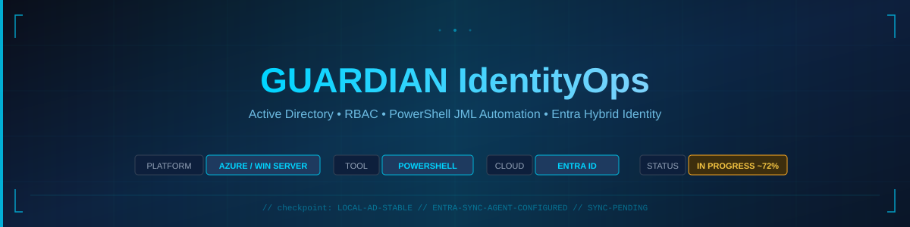

<p align="center">
  
</p>

<br>

<p align="center">
  
  
  
  
</p>

---

## `> cat overview.txt`

```
[*] Lab Name    : Guardian Financial Technologies (GFT) — Hybrid IAM Lab
[*] Platform    : Microsoft Azure (VM) + Windows Server 2022
[*] Domain      : corp.guardianlab.internal
[*] DC          : DC01
[*] Resources   : Standard_D2als_v7  |  2 vCPU  |  4 GiB RAM
[*] Network     : vnet-gft-identity  |  10.0.0.0/16  |  East US 2

[+] Identity lifecycle lab demonstrating Active Directory, RBAC,
[+] PowerShell Joiner/Mover/Leaver automation, access auditing, and
[+] identity governance control validation — with active, in-progress
[+] preparation for Microsoft Entra hybrid synchronization.

[✓] Local AD / IAM lifecycle phase ......... COMPLETE
[~] Microsoft Entra hybrid sync phase ...... IN PROGRESS
[i] Overall project completion ............. ~70-75%
```

This lab goes beyond a basic AD build. It demonstrates *controlled* identity lifecycle management: role-based access, PowerShell automation with verified safe dry-run behavior, independent post-change verification, access auditing, and governance control testing — with an honest, unfinished cloud/hybrid layer on top, not a fabricated one.

**Want the full story with screenshots inline, step by step?** → [`walkthrough/README.md`](walkthrough/README.md)
**Want to know exactly what's historical lab evidence vs. reconstructed public code?** → [`docs/reconstruction-notes.md`](docs/reconstruction-notes.md)

---

## `> ls -la ~/skills`

| | Skill | Details |
|---|---|---|
| 🖥️ | **Active Directory** | Forest/domain build, OU hierarchy, DNS |
| ⚡ | **PowerShell** | Modular automation, `SupportsShouldProcess`, structured logging |
| 🔐 | **RBAC** | 14 security groups, role-to-group mapping, zero direct assignment |
| 🔄 | **IAM Lifecycle** | Joiner / Mover / Leaver — all three validated live |
| 📋 | **Access Auditing** | Automated mismatch detection across test identities |
| 🧪 | **Control Validation** | 7 identity governance controls, independently tested |
| ☁️ | **Entra Hybrid Prep** | UPN suffix planning, Cloud Sync agent + gMSA configured |
| 🛠️ | **Troubleshooting** | Found and fixed a live `-WhatIf` safety bug before it shipped |
| 🌐 | **Azure Networking** | VNet, NSG hardening, static IP, auto-shutdown cost control |

---

## `> cat architecture.txt`

```
┌──────────────────────────────────────────────────────────────┐
│                     Azure  (rg-gft-identitylab)               │
│                                                                │
│   ┌────────────────────────────────────────────────────────┐  │
│   │              DC01 — Windows Server 2022                │  │
│   │                                                        │  │
│   │   Active Directory Domain Services + DNS               │  │
│   │   Forest / Domain: corp.guardianlab.internal            │  │
│   │                                                        │  │
│   │   OUs                       Security Groups (14)       │  │
│   │   ├── IT               →   GG-IT-Users / HelpDesk      │  │
│   │   ├── Security         →   GG-Security-* / Analysts    │  │
│   │   ├── Human Resources  →   GG-HR-Users                 │  │
│   │   ├── Finance          →   GG-Finance-* / FinanceApp   │  │
│   │   ├── Operations       →   GG-Operations-Users         │  │
│   │   ├── Contractors      →   GG-Contractors (isolated)   │  │
│   │   └── Disabled Users   →   (offboarded, zero access)   │  │
│   └────────────────────────────────────────────────────────┘  │
│                            │                                  │
│                            ▼                                  │
│              Entra Cloud Sync Agent (gMSA-based)               │
│              STATUS: installed + configured                    │
│              STATUS: sync NOT yet executed  ⚠                  │
└──────────────────────────────────────────────────────────────┘
                             │
                             ▼
              Microsoft Entra ID  (tenant accessed, not yet synced)
              MFA / Conditional Access / SSO — NOT CONFIGURED
```

**RBAC model:**
```
User → Global Security Group → Resource Access   (never User → Resource directly)
```

---

## `> tree ./repo`

```
guardian-identityops/
├── README.md
├── SECURITY.md
├── assets/
│   └── banner.svg
├── docs/
│   ├── architecture.md
│   ├── project-status.md
│   ├── lessons-learned.md
│   ├── joiner-workflow.md
│   ├── mover-workflow.md
│   ├── leaver-workflow.md
│   ├── hybrid-identity-progress.md
│   └── reconstruction-notes.md
├── scripts/
│   ├── Invoke-Joiner.ps1
│   ├── Invoke-Mover.ps1
│   ├── Invoke-Leaver.ps1
│   ├── New-LabUsers.ps1
│   ├── Get-AccessAudit.ps1
│   ├── Test-IdentityControls.ps1
│   └── Modules/
│       └── IAMLabCommon.psm1
├── sample-data/
│   └── employees.example.csv
└── screenshots/
    └── README.md
```

---

## `> cat workflows.txt`

### Joiner — `Olivia Bennett` (GFT1031, Finance Analyst)
```
Employee record → -WhatIf preview (no changes) → verified clean
       ↓
Invoke-Joiner.ps1 executes
       ↓
AD account created → OU=Finance → 6 groups assigned
       ↓
Independent Get-ADUser check → VerificationPassed: True ✓
```

### Mover — `Daniel Kim` (GFT1012, HR Coordinator → Junior SysAdmin)
```
Approved change → -WhatIf preview → verified clean
       ↓
Invoke-Mover.ps1 executes
       ↓
GG-HR-Users removed → GG-IT-Users added → OU moved to IT
       ↓
Independent check → GG-Server-Admins confirmed ABSENT ✓
       ↓
VerificationPassed: True — no privilege accumulation on title change ✓
```

### Leaver — `Marcus Reed` (GFT1004, Finance Contractor, terminated)
```
Termination confirmed → -WhatIf preview → verified clean
       ↓
Invoke-Leaver.ps1 executes
       ↓
Account disabled → GG-Contractors removed → moved to Disabled Users OU
       ↓
Independent check → post-offboarding groups = Domain Users ONLY ✓
```

Full before/whatif/after detail for each: [`docs/joiner-workflow.md`](docs/joiner-workflow.md) · [`docs/mover-workflow.md`](docs/mover-workflow.md) · [`docs/leaver-workflow.md`](docs/leaver-workflow.md)

---

## `> ./Get-AccessAudit.ps1`

```
[HISTORICAL LAB RESULT — see docs/reconstruction-notes.md]

Auditing 3 lifecycle test identities...

  olivia.bennett   [Finance]   [Active]    → expected access  ✓
  daniel.kim       [IT]        [Active]    → expected access  ✓
  marcus.reed      [Disabled]  [Disabled]  → zero access       ✓

RESULT: 0 of 3 accounts flagged with an access mismatch.
```

`Get-AccessAudit.ps1` was found to be a non-functional placeholder (empty group list, hardcoded "no mismatch") and has been reconstructed to actually query AD and compare against expected access. The result above is preserved as a real lab finding — it has **not yet been re-validated** against the reconstructed script.

## `> ./Test-IdentityControls.ps1`

```
[HISTORICAL LAB RESULT — see docs/reconstruction-notes.md]

CONTROL-001  Disabled users are not members of business groups .... PASS
CONTROL-002  Contractors do not have GG-Server-Admins ............. PASS
CONTROL-003  FinanceApp access limited to approved Finance Analysts PASS
CONTROL-004  Help Desk users do not have server admin rights ...... PASS
CONTROL-005  Privileged access uses separate adm- style accounts .. PASS
CONTROL-006  Disabled users are located in the Disabled Users OU .. PASS
CONTROL-007  Active employees have expected department groups ..... PASS

IDENTITY CONTROLS: PASS  (7 / 7)
```

`Test-IdentityControls.ps1` was found to unconditionally return PASS for every control regardless of AD state and has been reconstructed so each control runs a real query. The result above is preserved as a real lab finding — it has **not yet been re-validated** against the reconstructed script.

---

## `> cat entra_hybrid_status.txt`

```
[✓] Entra tenant accessed (Microsoft Entra ID Free)
[✓] Verified *.onmicrosoft.com UPN suffix added to AD
[✓] Pilot identity (Olivia Bennett) UPN updated + confirmed
[✓] Dedicated cloud-only Hybrid Identity Administrator created + MFA registered
[✓] Cloud Sync provisioning agent installed on DC01 (gMSA: provAgentgMSA)
[✓] Agent configuration confirmed

[ ] Cloud Sync configuration created
[ ] Sync agent health verified in Entra
[ ] OU/group sync scoping applied
[ ] Any user actually synchronized
[ ] Cloud sign-in / password-hash validation
[ ] Conditional Access deployed or tested
[ ] SSO / SAML / OIDC application
[ ] Managed Identity / Key Vault
[ ] Access Reviews / SCIM

>> Session ended immediately after agent config, before sync execution.
>> Nothing below the line above has been run or validated. Full detail
   in docs/hybrid-identity-progress.md — this is not glossed over.
```

---

## `> cat security_decisions.txt`

```
[1] Group-based access ONLY. No direct-to-user grants.
[2] Contractors get GG-Contractors and nothing else, by default.
[3] A sysadmin-sounding title never auto-grants GG-Server-Admins.
[4] Privileged access = separate adm- accounts, never the daily-driver login.
[5] The Entra Hybrid Identity Admin is cloud-only, MFA-enforced, and
    deliberately holds NO Azure subscription/VM permissions.
[6] -WhatIf is never trusted on its own — every dry run is checked
    against live AD state before the real run is trusted. (see below)
[7] No secrets, tenant IDs, subscription IDs, or public IPs are
    committed to this repo. See SECURITY.md.
```

---

## `> cat lessons_learned.txt`

```
[1] -WhatIf lied once. Believe verification, not the flag.
    Invoke-Joiner.ps1's first build still created a real AD account
    during a dry run. Caught by manually running Get-ADUser after the
    "preview" and finding the account existed. Fixed with correct
    SupportsShouldProcess / $PSCmdlet.ShouldProcess() implementation,
    then re-verified the same way — independently, not by re-trusting
    the flag.

[2] Mover = remove AND add, same operation.
    Daniel's HR access came off in the same run that granted IT
    access — not left behind as a "clean up later" step.

[3] A title is not a permission.
    "Junior System Administrator" did not earn GG-Server-Admins.
    Privilege is a separate, deliberate decision every time.

[4] Offboarding only counts if it's re-checked afterward.
    Marcus's termination was independently audited post-run, not
    just trusted because the script printed "success."

[5] Azure RBAC ≠ Entra directory roles.
    Hybrid Identity Administrator needed zero Azure VM access to do
    its job. Different permission systems, kept separate on purpose.

[6] Hybrid identity starts with UPN planning, not with the sync agent.
    corp.guardianlab.internal isn't routable — a verified
    *.onmicrosoft.com suffix had to exist and be applied to the pilot
    user before sync could even be meaningfully attempted.
```

---

## `> cat screenshots/README.md`

54 evidence screenshots are indexed and reserved in [`screenshots/README.md`](screenshots/README.md), covering every completed step from `DC01` deployment through Entra Cloud Sync agent configuration. None are committed yet — each will be sanitized (no passwords, tenant IDs, subscription IDs, or public IPs) before upload. See `SECURITY.md`.

---

## `> cat project_status.txt`

```
LOCAL AD / IAM FOUNDATION ................. COMPLETE
JML AUTOMATION (JOINER/MOVER/LEAVER) ...... COMPLETE
RBAC / SECURITY GROUP MODEL ................ COMPLETE
ACCESS AUDITING ............................ COMPLETE
IDENTITY CONTROL VALIDATION ................ COMPLETE  (7/7 PASS)
ENTRA HYBRID PREP (tenant/UPN/agent) ....... COMPLETE
ACTUAL ENTRA CLOUD SYNC .................... NOT COMPLETED
CONDITIONAL ACCESS ......................... NOT COMPLETED
SSO ......................................... NOT COMPLETED
MANAGED IDENTITY / KEY VAULT ............... NOT COMPLETED

OVERALL: ~70-75% COMPLETE
```

Full breakdown: [`docs/project-status.md`](docs/project-status.md) · Full incomplete-work inventory: [`docs/hybrid-identity-progress.md`](docs/hybrid-identity-progress.md)

---

## `> grep -i "resume" summary.txt`

> Built a hybrid Microsoft identity lab for a fictional fintech (Guardian Financial Technologies) — deploying Active Directory on Azure, designing group-based RBAC across 14 security groups, and building PowerShell Joiner/Mover/Leaver automation with verified `-WhatIf` safety, independent post-change verification, and 7/7 passing identity governance controls. Extended into Microsoft Entra hybrid identity by provisioning a dedicated Hybrid Identity Administrator and configuring the Entra Cloud Sync agent with a gMSA — cloud synchronization itself is the next phase in progress.

---

## Disclaimer

Simulated environment for educational/portfolio purposes. Guardian Financial Technologies is a fictional company; no real personal data is used. No real tenant IDs, subscription IDs, public IPs, passwords, or secrets are included — see `SECURITY.md`. Everything marked complete above was independently verified during the lab session; everything marked not completed has not been run or validated and is not claimed as working. Some public scripts were found to be non-functional scaffolds that didn't match the evidenced lab behavior and have since been reconstructed from that evidence — see `docs/reconstruction-notes.md` for exactly what was reconstructed and what still needs a fresh lab re-run to confirm.

---

<p align="center">Part of the <a href="https://github.com/Luisv-Cyber"><strong>Luisv-Cyber</strong></a> security &amp; sysadmin lab portfolio</p>

<p align="center">
  <a href="https://github.com/Luisv-Cyber"></a>
  &nbsp;
  <a href="https://www.linkedin.com/in/luisvega03"></a>
</p>

<p align="center">
  <sub>// checkpoint: LOCAL-AD-STABLE &nbsp;|&nbsp; ENTRA-SYNC-AGENT-CONFIGURED &nbsp;|&nbsp; SYNC-PENDING &nbsp;|&nbsp; Azure · Windows Server · Active Directory · PowerShell · Microsoft Entra ID</sub>
</p>
