# Build Walkthrough

This is a step-by-step narrative of how GUARDIAN IdentityOps was actually built, in the order it happened — what was done, why, how it was verified, and the screenshot proving it. For the condensed technical reference, see the main [`README.md`](../README.md) and [`docs/`](../docs/); this document is the story version.

Every image below is a real screenshot taken during the build. Nothing here is staged or reconstructed after the fact — the images are historical evidence. The *public scripts* in `scripts/` are a separate matter: some were found to be non-functional scaffolds that didn't match what these screenshots show, and have since been reconstructed from this same evidence. See [`docs/reconstruction-notes.md`](../docs/reconstruction-notes.md) for exactly which is which.

---

## 1. Azure Infrastructure

The domain controller needed somewhere to live first. A resource group (`rg-gft-identitylab`) and virtual network (`vnet-gft-identity`, `10.0.0.0/16` with a `snet-servers` subnet on `10.0.1.0/24`) were created in East US 2, then a Windows Server 2022 VM (`DC01`, `Standard_D2als_v7`) was provisioned into it.

**Basics tab** — VM name, region, image, and size selected:

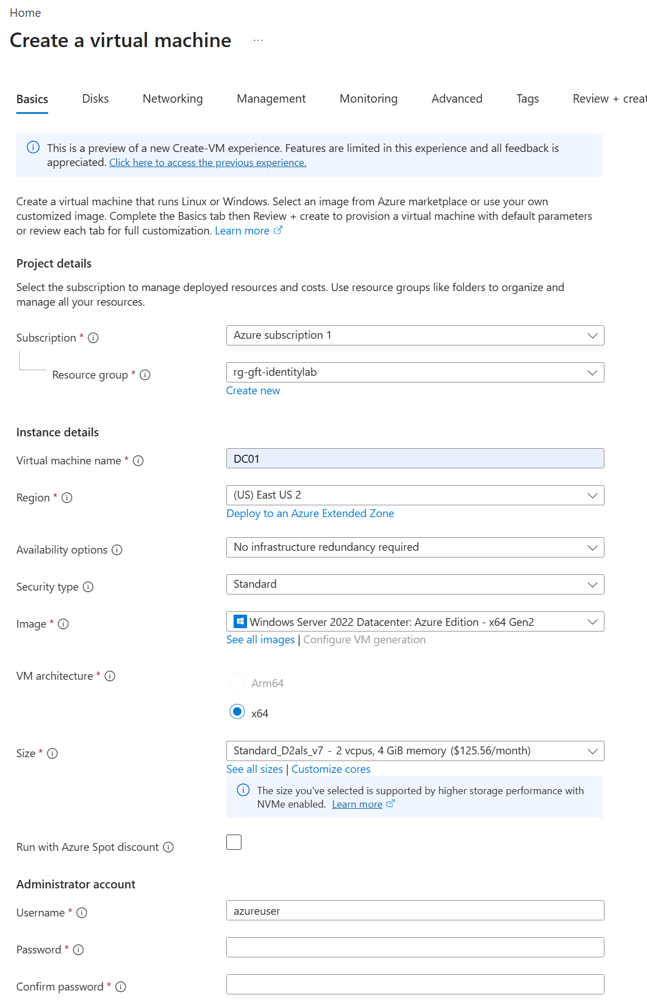

**Networking tab** — attached to the VNet/subnet, with an NSG configured from the start rather than left on defaults:

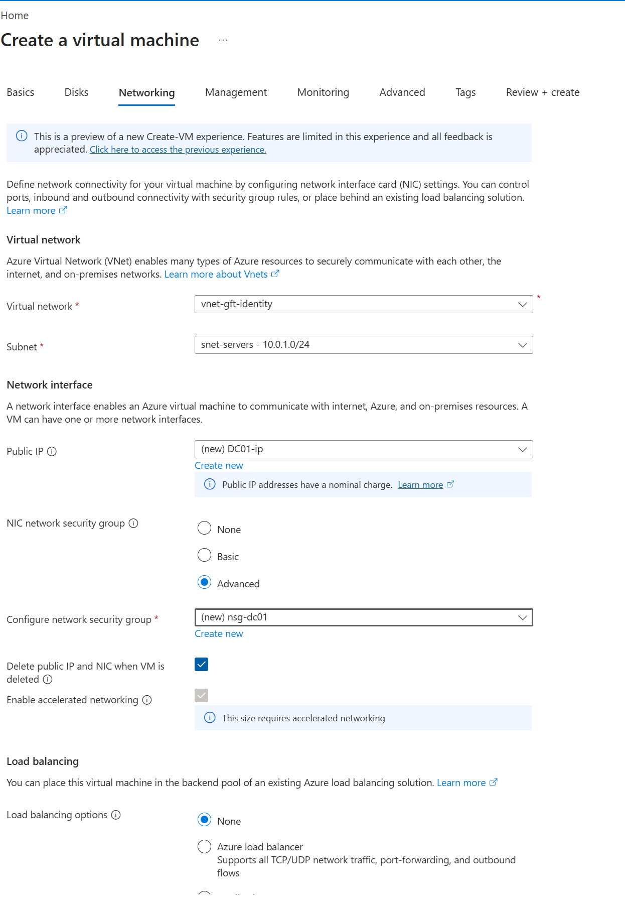

**Review + create** — final configuration confirmed before deployment:

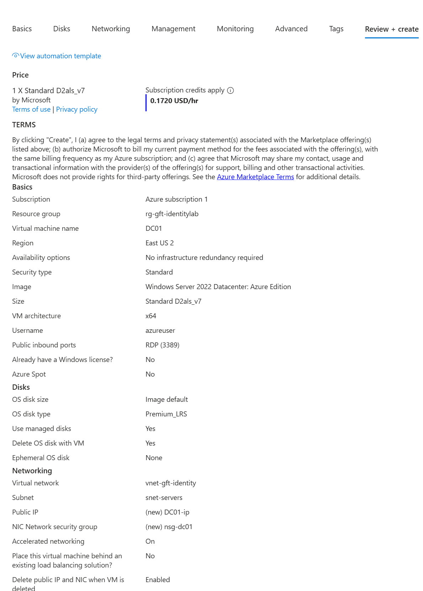

Once deployed, the NIC's private IP was pinned to static at the Azure platform layer, a scoped RDP rule (source = a single IP, not `0.0.0.0/0`) replaced the default rule, and auto-shutdown was enabled to control cost while the VM sat idle between sessions.

---

## 2. Active Directory Domain Services

With the VM up, the AD DS and DNS roles were installed, then the server was promoted to a domain controller for a brand-new forest: `corp.guardianlab.internal`.

**Prerequisites check** — validated clean before the actual promotion ran:

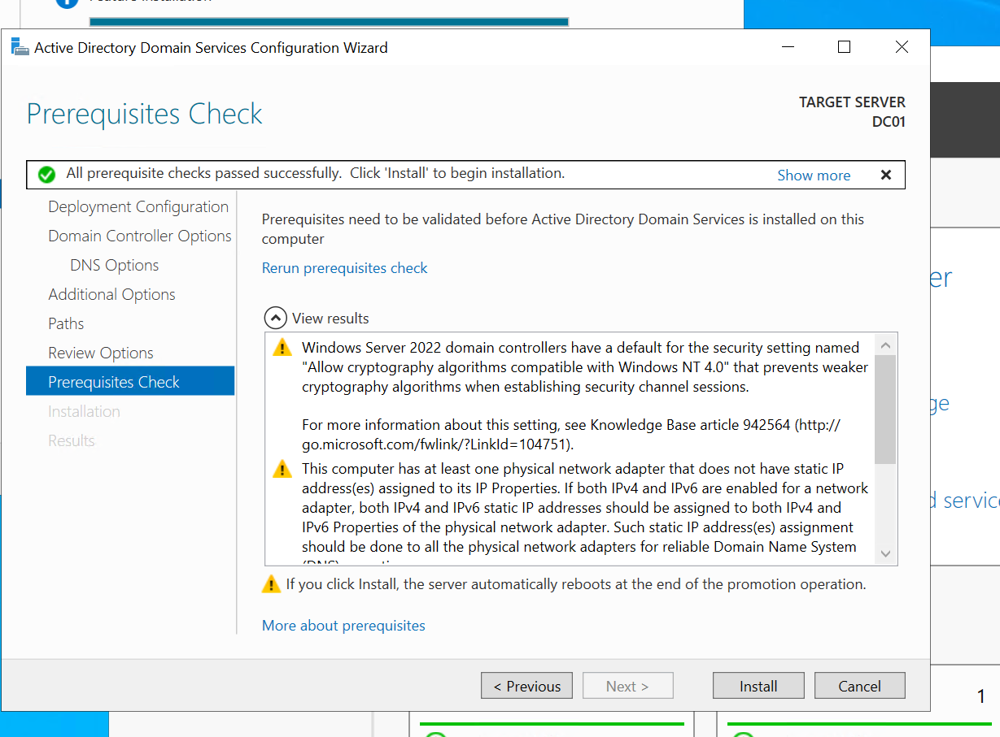

After promotion and reboot, `hostname`, `Get-ADDomain`, `Get-ADForest`, and `Get-Service DNS,NTDS` all confirmed the domain was live and both services were running (see [`docs/architecture.md`](../docs/architecture.md) for the exact output).

---

## 3. OU Structure and RBAC Security Groups

Before any users existed, the OU hierarchy was built out under a top-level `GFT` container — one OU per department, plus `Groups`, `Servers`, `Service Accounts`, `Administrative Accounts`, `Disabled Users`, and `Contractors`. Then all fourteen RBAC security groups were created as Global Security Groups, following the `GG-Department-Role` naming convention.

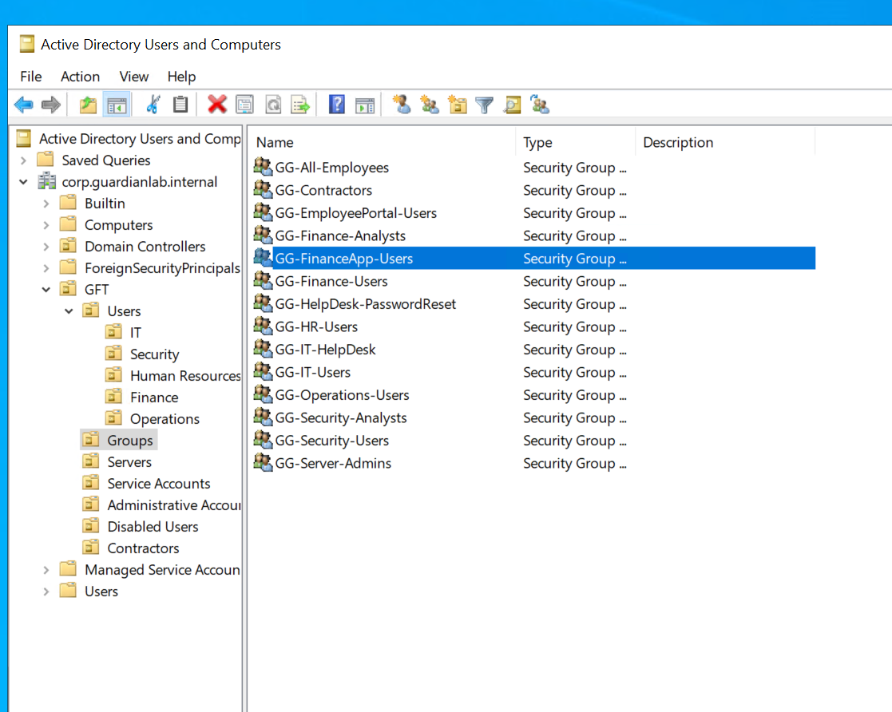

This is the layer everything else depends on: every identity lifecycle script assumes this OU/group structure already exists, which is exactly what `Test-LabEnvironment` checks before anything else runs (next section).

---

## 4. PowerShell Automation and Environment Validation

The automation package (`New-LabUsers.ps1`, `Invoke-Joiner.ps1`, `Invoke-Mover.ps1`, `Invoke-Leaver.ps1`, `Get-AccessAudit.ps1`, `Test-IdentityControls.ps1`, and the shared `IAMLabCommon.psm1` module) was deployed to `C:\GFT-IAM\Scripts`. Before running any lifecycle script against the environment, `Test-LabEnvironment` was run to confirm every OU and group it depends on actually exists.

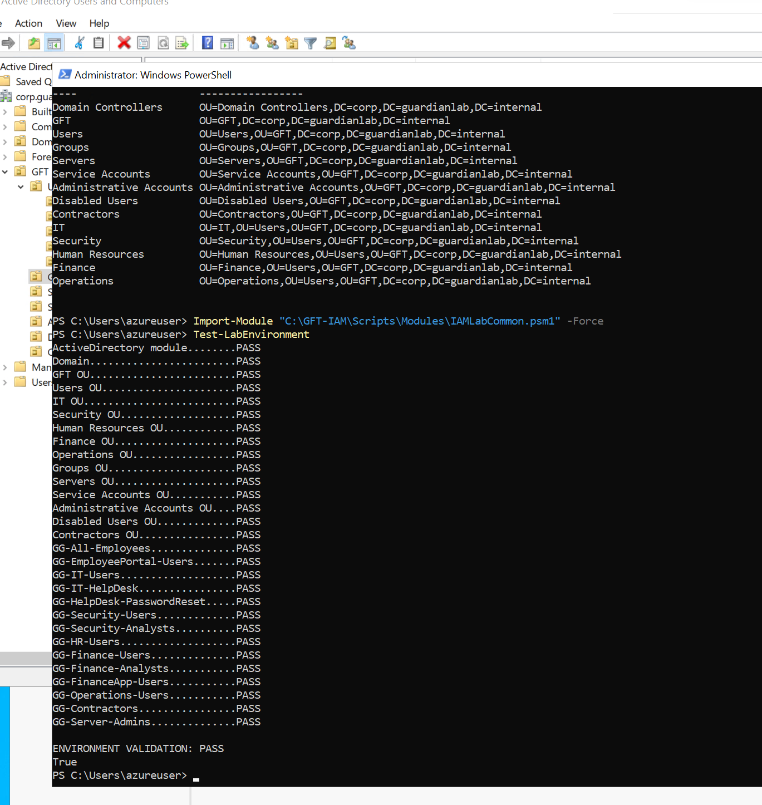

The fictional employee dataset (`employees.csv`) — the "HR feed" every lifecycle script reads from — was seeded at this point too:

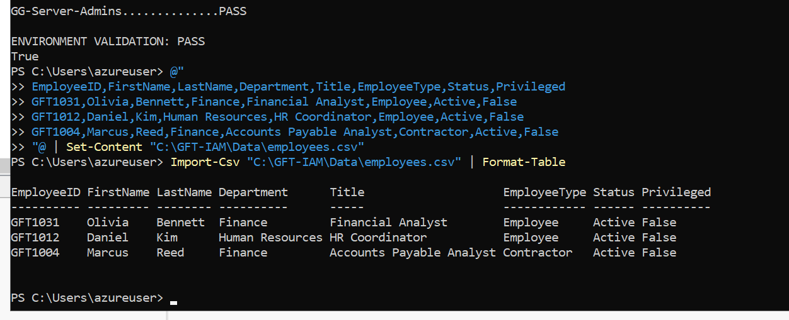

---

## 5. Joiner Workflow — Olivia Bennett

**Test identity:** Olivia Bennett (`GFT1031`), Finance Analyst.

The dry run came first. `-WhatIf` previewed the target username, OU, and expected groups without touching AD — and because of a bug caught earlier in testing (see [`docs/lessons-learned.md`](../docs/lessons-learned.md)), the dry run's claim of "no changes made" was independently verified with `Get-ADUser` immediately after, which confirmed the account genuinely did not exist yet.

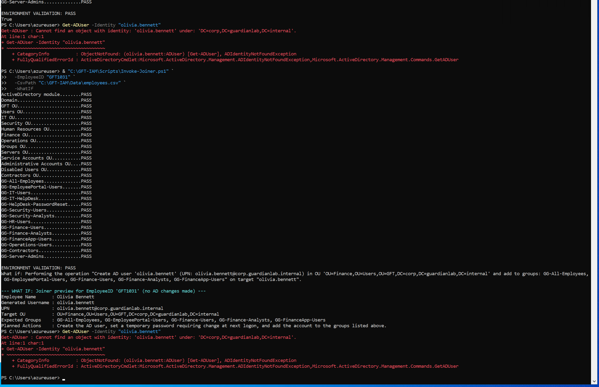

Only after that did the real run execute. Afterward, group membership was checked independently rather than trusted from script output:

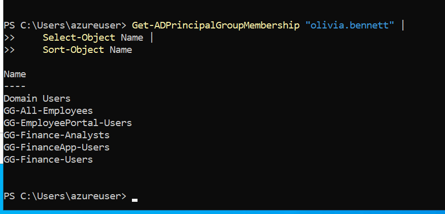

And the audit log confirmed the same story end-to-end — dry run, no changes, then the real creation:

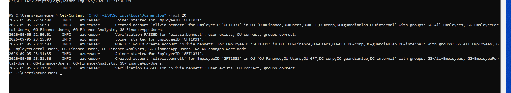

---

## 6. Mover Workflow — Daniel Kim

**Test identity:** Daniel Kim (`GFT1012`), HR Coordinator → IT, Junior System Administrator.

Before-state was captured first, so the "after" would actually mean something:

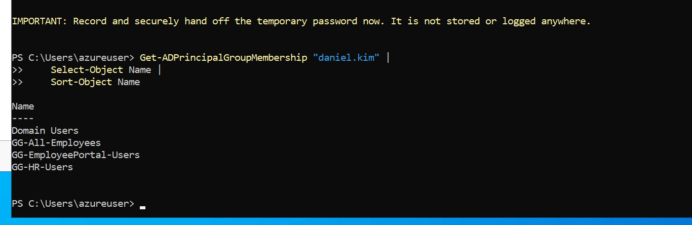

`-WhatIf` previewed exactly what would change — OU move, `GG-HR-Users` removed, `GG-IT-Users` added — with no AD changes made:

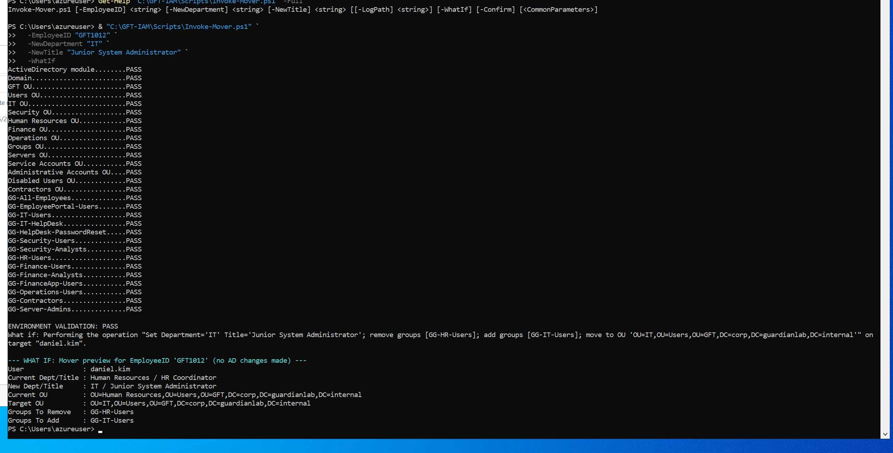

The real run executed, and the before/after state was captured in the same output — including confirmation that `GG-Server-Admins` was **not** added, despite the new title being "Junior System Administrator":

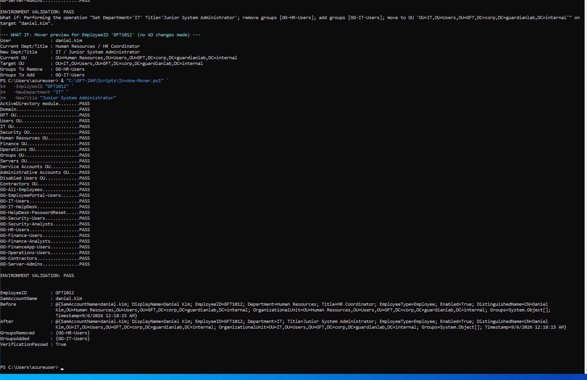

Group membership was checked independently afterward:

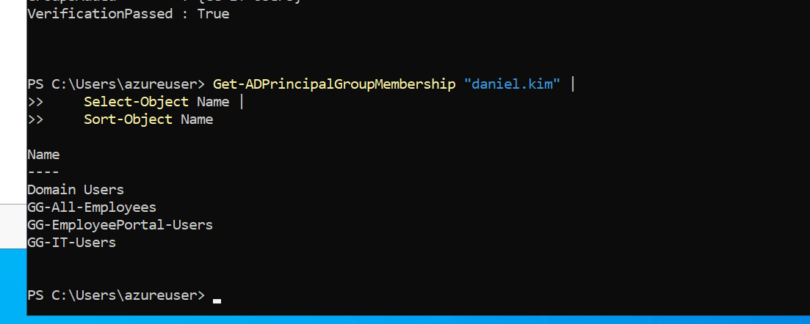

And `Mover.log` recorded the full sequence — the dry run, the real change, and a passed verification:

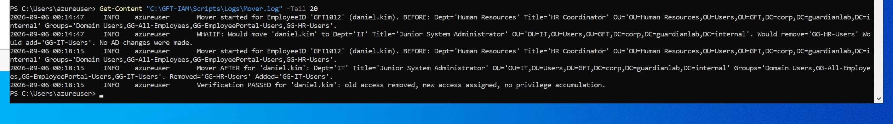

---

## 7. Leaver Workflow — Marcus Reed

**Test identity:** Marcus Reed (`GFT1004`), Finance contractor, terminated.

Before-state:

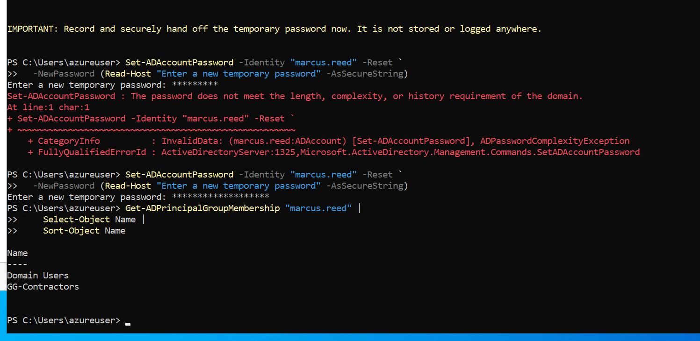

`-WhatIf` previewed the disable, group removal, and OU move — no changes made yet:

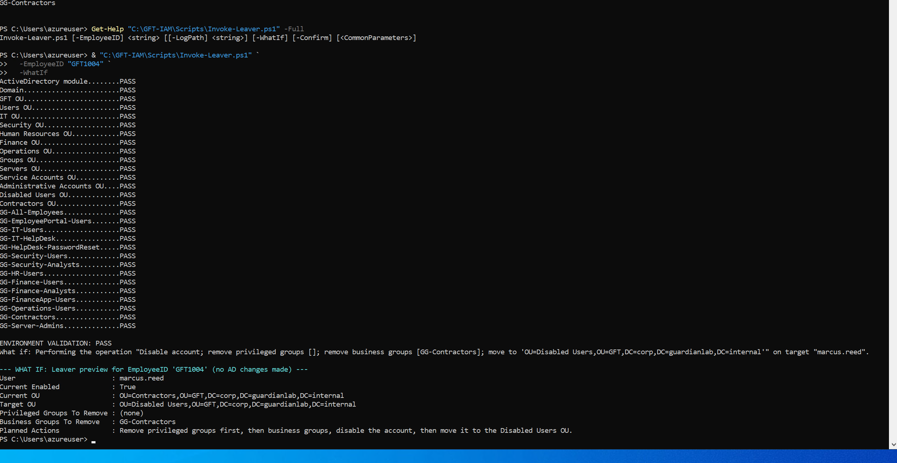

The real run executed: account disabled, `GG-Contractors` removed, moved to the Disabled Users OU. Group membership was checked independently afterward and came back with exactly one entry:

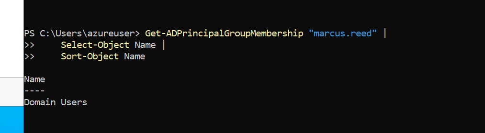

`Leaver.log` recorded the before state, the dry run, the real change, and a passed verification:

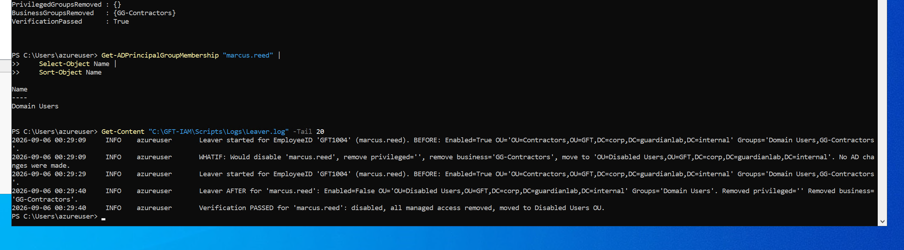

---

## 8. Access Audit

With all three lifecycle scenarios complete, `Get-AccessAudit.ps1` was run across all three test identities to check for any mismatch between actual and expected access.

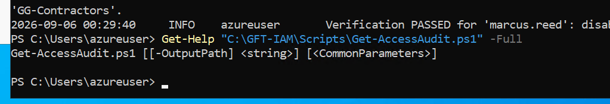

Result: **0 of 3 accounts flagged.** Marcus showed disabled with no business access, Olivia and Daniel showed active with exactly the access their roles should have.

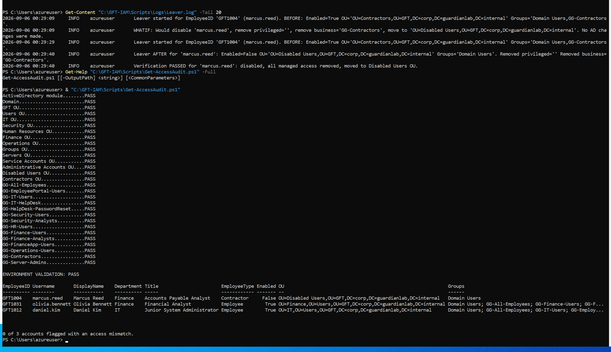

---

## 9. Identity Control Validation

Finally, `Test-IdentityControls.ps1` ran all seven identity governance controls — disabled users excluded from business groups, contractors excluded from `GG-Server-Admins`, Finance app access restricted to approved analysts, Help Desk excluded from server admin rights, privileged access limited to `adm-` accounts, disabled users physically located in the Disabled Users OU, and active employees holding the groups their department expects.

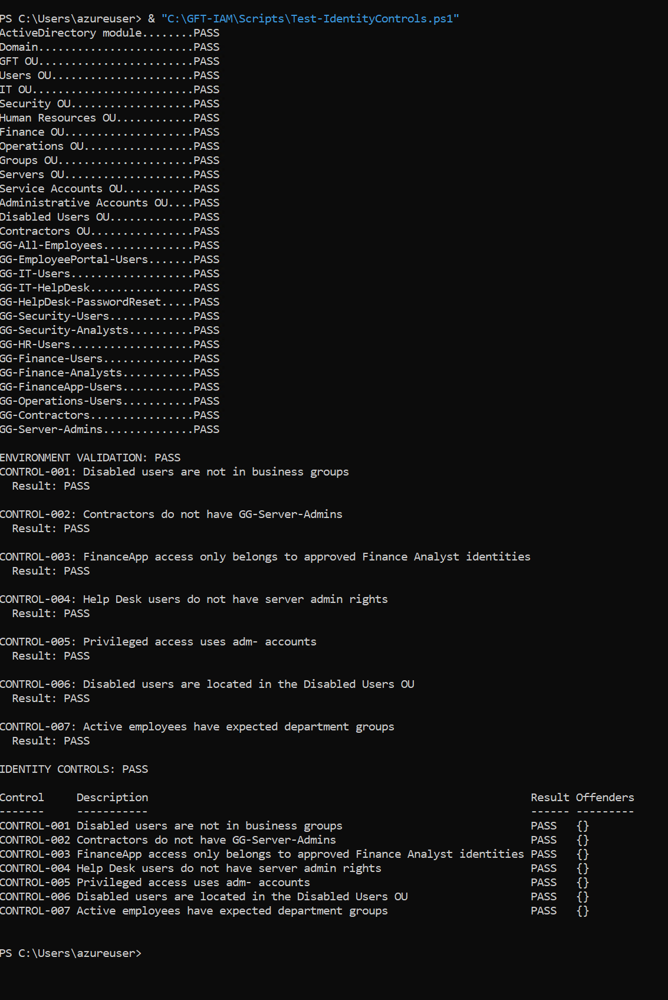

**Result: 7 of 7 controls passed.** This closes out the local AD / IAM phase of the project.

---

## 10. Microsoft Entra Hybrid Identity Preparation (in progress)

This phase is **not complete** — see [`docs/hybrid-identity-progress.md`](../docs/hybrid-identity-progress.md) for the full, explicit list of what has and hasn't been done. What's documented here is only what was actually finished and verified: the tenant was accessed, a routable UPN suffix was added and applied to a pilot identity, a dedicated cloud-only Hybrid Identity Administrator was created with MFA, and the Cloud Sync provisioning agent installation began.

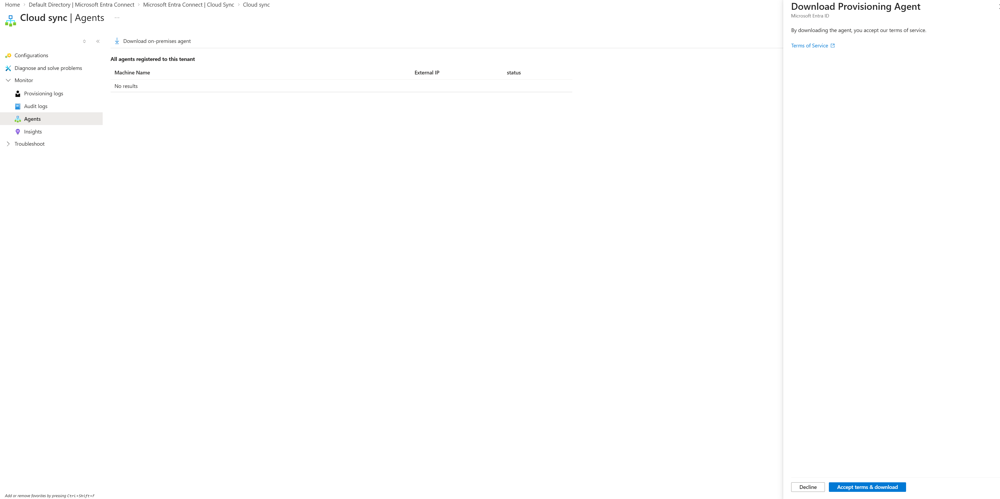

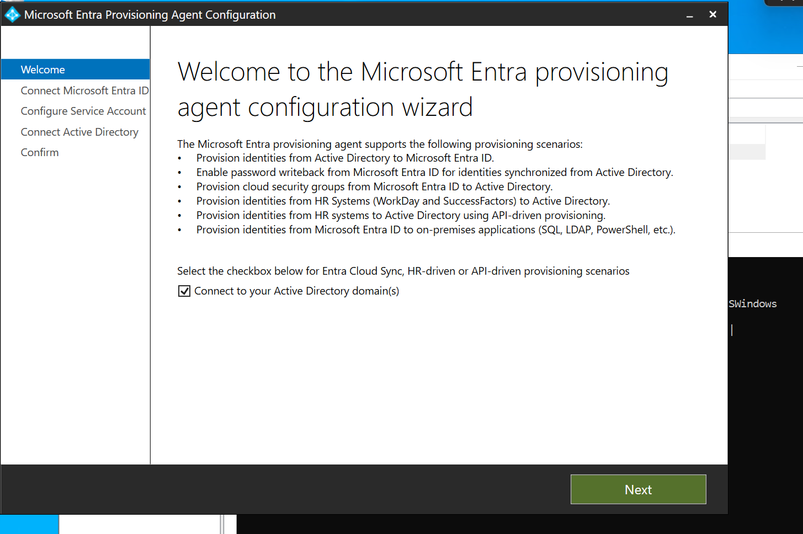

The lab session ended partway through the agent configuration wizard, before Cloud Sync itself was configured and before any user was actually synchronized. Nothing past this point — sync execution, Conditional Access, SSO, Managed Identity, Key Vault — has been attempted or is claimed as working.

---

## What's Not Shown Here

A few completed steps have evidence that exists but isn't included above because the raw screenshot exposed a public IP, tenant name, or similar detail (see [`SECURITY.md`](../SECURITY.md)). Those steps are still fully documented in prose in the main [`README.md`](../README.md) and [`docs/`](../docs/) — this walkthrough just doesn't have a redacted image to show for them yet.
